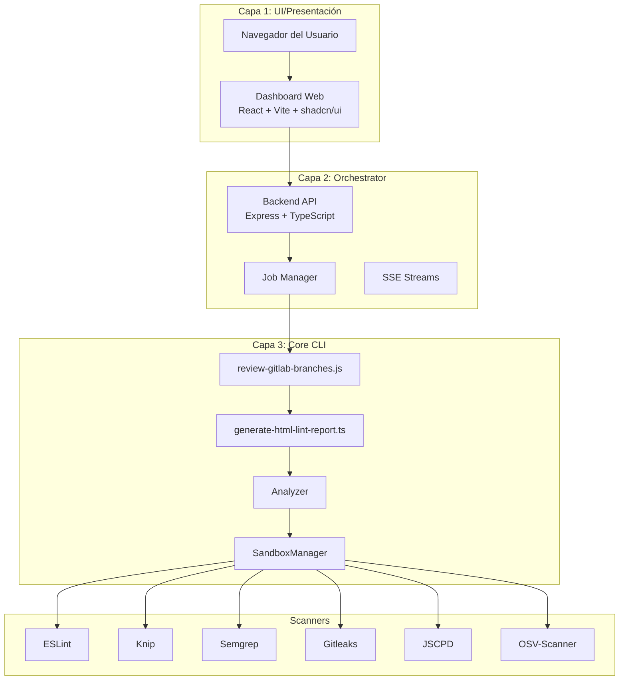
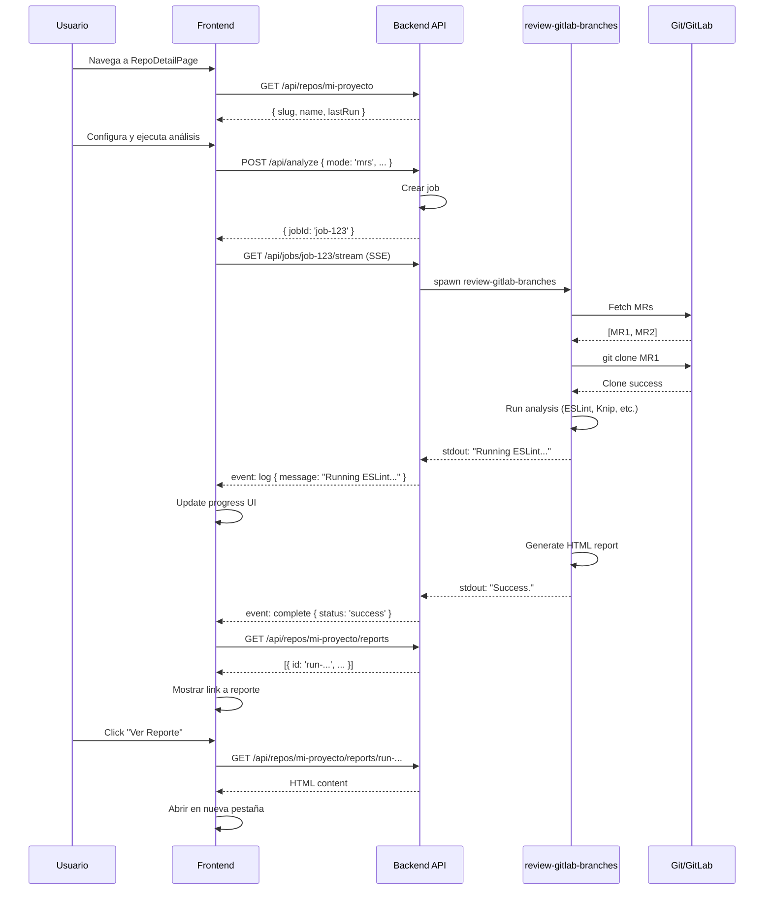

# ScriptC - Documentación Completa del Proyecto

## 📑 Tabla de Contenidos

1. [Resumen Ejecutivo](#resumen-ejecutivo)
2. [Arquitectura del Sistema](#arquitectura-del-sistema)
3. [Herramientas y Tecnologías](#herramientas-y-tecnologías)
4. [Estructura del Proyecto](#estructura-del-proyecto)
5. [Core CLI - Capa de Ejecución](#core-cli---capa-de-ejecución)
6. [Scanners - Motores de Análisis](#scanners---motores-de-análisis)
7. [Dashboard Web - Capa de Presentación](#dashboard-web---capa-de-presentación)
8. [Configuración y Variables de Entorno](#configuración-y-variables-de-entorno)
9. [Workflows y Casos de Uso](#workflows-y-casos-de-uso)
10. [Roadmap y Fases de Implementación](#roadmap-y-fases-de-implementación)
11. [Principios Arquitectónicos](#principios-arquitectónicos)
12. [Troubleshooting y FAQ](#troubleshooting-y-faq)

---

## 1. Resumen Ejecutivo

**ScriptC Code Reviewer** es una plataforma completa de análisis estático de código diseñada para proyectos TypeScript/JavaScript. Combina múltiples herramientas de análisis (ESLint, Knip, Semgrep, Gitleaks, JSCPD) en un sistema cohesivo con:

- **CLI potente** para análisis batch de ramas GitLab
- **Reportes HTML interactivos** con resaltado de código
- **Dashboard web** con progreso en tiempo real vía SSE
- **Arquitectura de 3 capas** (UI → Orchestrator → Core CLI)

### Características Principales

✅ **Multi-Scanner**: ESLint, Knip, Semgrep, Gitleaks, JSCPD, OSV-Scanner  
✅ **Integración GitLab**: Analiza MRs y ramas automáticamente  
✅ **Reportes Profesionales**: HTML con sintaxis highlighting (Shiki)  
✅ **Sandboxing**: Ejecución aislada sin contaminar proyectos  
✅ **Quality Gates**: Umbrales configurables para CI/CD  
✅ **Formatos Estándar**: SARIF y CodeClimate JSON  
✅ **Dashboard Moderno**: React + Vite + shadcn/ui  

---

## 2. Arquitectura del Sistema

ScriptC sigue una **arquitectura de tres capas**:



### Flujo de Ejecución

1. **Usuario** configura análisis en el Dashboard
2. **Backend API** crea un job y lo encola
3. **Job Manager** ejecuta `review-gitlab-branches.js` como proceso hijo
4. **CLI** clona el repositorio en sandbox (`.work/`)
5. **Sandbox Manager** crea environment virtual con symlinks a `node_modules`
6. **Analyzer** ejecuta todos los scanners habilitados
7. **HTML Generator** produce reporte con código resaltado
8. **API** sirve reportes y actualiza estado vía SSE

---

## 3. Herramientas y Tecnologías

### 3.1 Core Stack

| Componente | Tecnología | Versión | Propósito |
|------------|------------|---------|-----------|
| **Runtime** | Node.js | 18+ | Ejecución JavaScript/TypeScript |
| **Lenguaje** | TypeScript | 5.3+ | Type safety para Core CLI |
| **Build** | ts-node | 10.9+ | Ejecución TypeScript sin compilar |
| **Bundler** | Vite | 5.4+ | Build del Dashboard |

### 3.2 Scanners y Análisis

#### ESLint (Linting)
- **Versión**: 8.57.0
- **Propósito**: Análisis estático de código JS/TS
- **Plugins incluidos**:
  - `@typescript-eslint` - Reglas TypeScript
  - `eslint-plugin-unicorn` - Best practices
  - `eslint-plugin-sonarjs` - Complejidad cognitiva
  - `eslint-plugin-import` - Imports/exports
  - `eslint-plugin-security` - Vulnerabilidades de seguridad

#### Knip (Unused Code)
- **Versión**: Latest (npx)
- **Propósito**: Detectar exports, dependencias y archivos no usados
- **Features**:
  - Analiza `package.json` dependencies
  - Detecta exports sin usar
  - Identifica archivos huérfanos

#### Semgrep (SAST)
- **Versión**: Latest binary o Docker `returntocorp/semgrep:latest`
- **Propósito**: Security scanning con reglas semánticas
- **Config por defecto**: `p/ci` (community rules)
- **Timeout**: 120s
- **Fallback**: Docker si el binario no está instalado

#### Gitleaks (Secret Scanning)
- **Versión**: Latest binary o Docker `zricethezav/gitleaks:latest`
- **Propósito**: Detectar secretos hardcodeados
- **Detecta**: API keys, tokens, passwords, certificates
- **Formatos**: AWS, GitHub, GitLab, JWT, SSH, etc.

#### JSCPD (Code Duplication)
- **Versión**: 4.0.4
- **Propósito**: Detectar código duplicado
- **Threshold configurable**: Percentage de duplicación
- **Reporta**: Bloques duplicados con ubicaciones

#### OSV-Scanner (Dependency Vulnerabilities)
- **Versión**: Latest binary o Docker `ghcr.io/google/osv-scanner:latest`
- **Propósito**: Escanear vulnerabilidades en dependencias
- **Source**: OSV.dev database (Google)
- **Cubre**: npm, PyPI, Go, Rust, etc.

### 3.3 Frontend Dashboard

| Librería | Versión | Propósito |
|----------|---------|-----------|
| **React** | 18.3.1 | Framework UI |
| **React Router** | 6.30.1 | Navegación SPA |
| **Tailwind CSS** | 3.4.17 | Utility-first CSS |
| **shadcn/ui** | Latest | Componentes UI (Radix UI) |
| **Lucide React** | 0.462.0 | Iconos |
| **Recharts** | 2.15.4 | Gráficas |
| **TanStack Query** | 5.83.0 | State management asíncrono |

### 3.4 Backend Orchestrator

| Librería | Versión | Propósito |
|----------|---------|-----------|
| **Express** | 5.1.0 | Web framework |
| **tsx** | 4.20.6 | TypeScript execution |
| **cors** | 2.8.5 | CORS middleware |
| **compression** | 1.7.4 | Compresión gzip |

### 3.5 Reporting

| Librería | Versión | Propósito |
|----------|---------|-----------|
| **Shiki** | 1.3.0 | Syntax highlighting |
| **stream-json** | 1.8.0 | Procesamiento JSON streaming |

---

## 4. Estructura del Proyecto

```
scriptCCode/
├── bin/                                    # Executables CLI
│   ├── review-gitlab-branches.js          # Proxy ts-node
│   └── review-gitlab-branches.ts          # CLI principal (360 líneas)
│
├── lib/                                    # Core libraries
│   ├── analyzer.ts                        # Orquestador de scanners (319 líneas)
│   ├── html-generator.ts                  # Generador de reportes HTML (910 líneas)
│   ├── sandbox.ts                         # VirtualEnvironment + SandboxManager (120 líneas)
│   ├── git.ts                             # Wrapper de Git (108 líneas)
│   ├── gitlab.ts                          # Cliente GitLab API (195 líneas)
│   ├── stream-utils.ts                    # Utilidades para JSON streaming (92 líneas)
│   ├── utils.ts                           # Logger, sanitizeName, etc. (82 líneas)
│   └── scanners/                          # Strategy pattern scanners
│       ├── scanner.interface.ts           # Interface base (30 líneas)
│       ├── knip.scanner.ts                # Scanner Knip (186 líneas)
│       ├── semgrep.scanner.ts             # Scanner Semgrep (104 líneas)
│       └── gitleaks.scanner.ts            # Scanner Gitleaks (85 líneas)
│
├── packages/                               # Paquetes internos
│   └── dev-tools/                         # Meta-paquete devDependencies
│       ├── package.json                   # ESLint + plugins + TypeScript + ts-prune + jscpd
│       └── bin/
│           └── generate-eslint.js
│
├── repo-scan-dashboard-main/              # Dashboard Web (Capa 1 + 2)
│   ├── src/                               # Frontend React
│   │   ├── components/                    # Componentes UI
│   │   ├── pages/                         # HomePage, RepoDetailPage
│   │   ├── lib/                           # Utilidades (api.ts, analyzer.ts)
│   │   └── types/                         # TypeScript types
│   ├── server/                            # Backend Express
│   │   ├── index.ts                       # Entry point (210 líneas)
│   │   └── routes/                        # API endpoints
│   │       ├── repos.ts                   # GET /api/repos
│   │       ├── analyze.ts                 # POST /api/analyze
│   │       └── jobs.ts                    # GET /api/jobs/:id/*
│   ├── public/                            # Assets estáticos
│   ├── dist/                              # Build output
│   └── package.json                       # Dependencies
│
├── scripts/                                # Utilidades
│   ├── generate-eslintrc.js               # Generador de .eslintrc.js (151 líneas)
│   └── setup-p1-tools.sh                  # Instalador de Semgrep/Gitleaks/OSV (91 líneas)
│
├── .work/                                  # Clones temporales (gitignored)
├── reports/                                # Reportes locales (gitignored)
│
├── generate-html-lint-report.ts           # Entry point para reportes (86 líneas)
├── package.json                            # Root package.json
├── tsconfig.json                           # TypeScript config
├── .eslintrc.js                            # ESLint config (116 líneas)
├── Dockerfile                              # Docker build para producción
├── README.md                               # Documentación principal
├── GEMINI.md                               # Directivas arquitectónicas (Las 3 Leyes)
└── DOCUMENTACION_COMPLETA.md               # Este archivo

Total Lines of Code (estimado): ~15,000 líneas
```

---

## 5. Core CLI - Capa de Ejecución

### 5.1 review-gitlab-branches.ts

**Propósito**: Orquestador principal que clona repositorios, ejecuta análisis y gestiona reportes.

#### Responsabilidades

1. **Parsing de argumentos CLI**
2. **Integración GitLab API** (fetch MRs/branches)
3. **Clonado de repositorios** con `git clone --depth=1`
4. **Setup de sandbox** via `VirtualEnvironment`
5. **Ejecución de análisis** via `runAnalysisScript()`
6. **Gestión de reportes** (copia de `.work/` a `reports/`)
7. **Cleanup** de clones temporales

#### Parámetros

```bash
node bin/review-gitlab-branches.js \
  --repo <url>                      # URL del repositorio Git
  --branches <b1,b2,b3>             # Lista de ramas a analizar
  --from-gitlab-mrs                 # Fetch MRs automáticamente
  --from-gitlab-branches            # Fetch ramas del repo
  --work-dir <path>                 # Directorio para clones (.work)
  --reports-dir <path>              # Directorio de salida (reports)
  --ignore <patterns>               # Patrones a ignorar (globs)
  --globs <patterns>                # Archivos a analizar
  --install-dev <spec>              # Meta-paquete a instalar
  --depth <n>                       # Git clone depth (default: 1)
  --gitlab-token <token>            # Token de GitLab
  --gitlab-base <url>               # Base URL API GitLab
  --report-script <path>            # Script generador de reportes
  --no-cleanup                      # No eliminar clones
```

#### Flujo de Ejecución

```typescript
// 1. Parse argumentos y cargar .env
const opts = parseArgs();
loadEnvFromFile(envFile);

// 2. Fetch tasks (branches o MRs)
const tasks = [];
if (opts.fromGitlabMrs) {
  const mrs = await gitlab.fetchOpenMergeRequests(opts.repo);
  tasks.push(...mrs);
}

// 3. Para cada task
for (const task of tasks) {
  const cloneDir = path.join(workDir, sanitizeName(task.slug));
  
  // 3.1 Clonar repositorio
  git.clone(authUrl, cloneDir, task.branch, opts.depth);
  
  // 3.2 Setup sandbox (symlinks a node_modules)
  const venv = new VirtualEnvironment(cloneDir, sourceNodeModules, logger);
  venv.setup();
  
  // 3.3 Ejecutar análisis
  await runAnalysisScript(
    reportScript,
    cloneDir,
    [...ignoreArgs, ...globsArgs],
    { 
      NODE_PATH: path.join(cloneDir, 'node_modules'),
      ANALYSIS_TARGET_DIR: cloneDir  // Fix directory resolution
    },
    logFile
  );
  
  // 3.4 Copiar reportes
  fs.copyFileSync(
    path.join(cloneDir, 'reports/lint-report.html'),
    path.join(taskReportDir, 'lint-report.html')
  );
  
  // 3.5 Cleanup
  if (opts.cleanup) {
    fs.rmSync(cloneDir, { recursive: true, force: true });
  }
}

// 4. Guardar summary.json
summaryManager.save();
```

#### Variables de Entorno Soportadas

- `GITLAB_TOKEN` / `GITLAB_PRIVATE_TOKEN`
- `GITLAB_BASE`
- `REPORT_SCRIPT_PATH`
- `INSTALL_DEV_SPEC`
- `DOTENV_PATH`
- `REUSE_CLONES=1` (experimental)

---

### 5.2 generate-html-lint-report.ts

**Propósito**: Entry point para generar reportes HTML desde un directorio de proyecto.

#### Workflow

```typescript
// 1. Parse argumentos
const opts = parseArgs(); // --globs, --ignore, --output

// 2. Resolver target directory
const targetDir = process.env.ANALYSIS_TARGET_DIR || process.cwd();

// 3. Crear Analyzer con todos los scanners
const analyzer = new Analyzer({
  cwd: targetDir,
  sandbox: new SandboxManager(targetDir, logger),
  globs: opts.globs ? [opts.globs] : undefined,
  ignore: opts.ignore,
  // Flags para deshabilitar scanners
  noJscpd: process.env.REPORT_NO_JSCPD === '1',
  noSemgrep: process.env.REPORT_NO_SEMGREP === '1',
  noGitleaks: process.env.REPORT_NO_GITLEAKS === '1',
  noKnip: false,
});

// 4. Ejecutar análisis
const data: AnalysisResult = await analyzer.run();

// 5. Guardar JSON
fs.writeFileSync('reports/lint-summary.json', JSON.stringify(data, null, 2));

// 6. Generar HTML
const generator = new HtmlGenerator({ cwd: targetDir });
const htmlContent = await generator.generate(data);
fs.writeFileSync('reports/lint-report.html', htmlContent);
```

#### Variables de Entorno

- `ANALYSIS_TARGET_DIR` - Directorio objetivo (set por review-gitlab-branches)
- `REPORT_USE_INTERNAL_ESLINT_CONFIG=1` - Forzar config interna de ESLint
- `REPORT_NO_JSCPD=1` - Deshabilitar JSCPD
- `REPORT_NO_SEMGREP=1` - Deshabilitar Semgrep
- `REPORT_NO_GITLEAKS=1` - Deshabilitar Gitleaks
- `REPORT_NO_SECRET_SCAN=1` - Deshabilitar heurísticos de secretos
- `REPORT_NO_OSV=1` - Deshabilitar OSV-Scanner

---

### 5.3 lib/analyzer.ts

**Propósito**: Orquestador de todos los scanners. Ejecuta ESLint, Knip, Semgrep, Gitleaks, JSCPD en paralelo y consolida resultados.

#### Arquitectura

```typescript
class Analyzer {
  private cwd: string;
  private sandbox: SandboxManager;
  private scanners: Scanner[] = [];
  
  constructor(options: AnalyzerOptions) {
    this.cwd = options.cwd;
    this.sandbox = options.sandbox;
    
    // Registrar scanners (Strategy Pattern)
    this.scanners = [
      new KnipScanner(),
      new SemgrepScanner(),
      new GitleaksScanner()
    ];
  }
  
  async run(): Promise<AnalysisResult> {
    // 1. Ejecutar ESLint (legacy)
    const eslintResults = await this.runEslint();
    
    // 2. Ejecutar JSCPD (legacy)
    const jscpd = this.runJscpd();
    
    // 3. Ejecutar scanners en paralelo
    const scanPromises = this.scanners.map(scanner => {
      if (scanner.isEnabled(this.options)) {
        return scanner.run({ cwd: this.cwd });
      }
      return Promise.resolve({ tool: scanner.name, status: 'skipped', findings: [] });
    });
    
    // 4. Await all
    const [eslintResults, jscpd, ...scanResults] = await Promise.all([
      eslintPromise,
      jscpdPromise,
      ...scanPromises
    ]);
    
    // 5. Consolidar resultados
    return {
      generatedAt: new Date().toISOString(),
      durationMs: Date.now() - start,
      summary: {
        errors: totalErrors,
        warnings: totalWarnings,
        files: eslintResults.length
      },
      results: eslintResults,
      jscpd,
      semgrep: semgrepResult,
      gitleaks: gitleaksResult,
      knip: knipResult,
      depCruiser: { findings: [] }
    };
  }
}
```

#### runEslint()

- Usa `fast-glob` para encontrar archivos según `globs` (default: `src/**/*.{js,ts,tsx,jsx}`)
- Aplica patrones de `ignore`
- Intenta usar `.eslintrc.*` del proyecto
- Fallback a config interna si falla

#### runJscpd()

- Ejecuta `npx jscpd` con spawn
- Genera `reports/jscpd-report.json`
- Lee resultado y extrae duplicados

---

### 5.4 lib/sandbox.ts

**Propósito**: Aislar análisis en directorios temporales con symlinks a dependencias.

#### VirtualEnvironment

```typescript
class VirtualEnvironment {
  constructor(
    private targetDir: string,          // Clone directory
    private sourceNodeModules: string,  // ScriptC's node_modules
    private logger: Logger
  ) {}
  
  setup(): void {
    // 1. Crear targetDir/node_modules/
    const targetModules = path.join(this.targetDir, 'node_modules');
    fs.mkdirSync(targetModules, { recursive: true });
    
    // 2. Symlink cada paquete de source a target
    const entries = fs.readdirSync(this.sourceNodeModules);
    for (const entry of entries) {
      const srcPath = path.join(this.sourceNodeModules, entry);
      const destPath = path.join(targetModules, entry);
      
      if (!fs.existsSync(destPath)) {
        fs.symlinkSync(srcPath, destPath, 'junction');
      }
    }
    
    // 3. Symlink .bin/
    const srcBin = path.join(this.sourceNodeModules, '.bin');
    const destBin = path.join(targetModules, '.bin');
    if (fs.existsSync(srcBin) && !fs.existsSync(destBin)) {
      fs.symlinkSync(srcBin, destBin, 'junction');
    }
  }
}
```

**Ventajas**:
- ✅ No contamina el proyecto objetivo
- ✅ No requiere `npm install` en cada clone
- ✅ Rápido (symlinks instantáneos)
- ✅ Cumple "The Law of Purity"

#### SandboxManager

```typescript
class SandboxManager {
  constructor(
    private workDir: string,
    private logger: Logger
  ) {}
  
  async initialize(): Promise<void> {
    fs.mkdirSync(this.workDir, { recursive: true });
  }
  
  async cleanup(): Promise<void> {
    fs.rmSync(this.workDir, { recursive: true, force: true });
  }
  
  runProcess(command, args, env, options): Promise<void> {
    const child = spawn(command, args, {
      cwd: options.cwd || this.workDir,
      env: { ...process.env, ...env },
      stdio: options.pipeLogs ? ['ignore', 'pipe', 'pipe'] : 'ignore'
    });
    // ...
  }
}
```

---

### 5.5 lib/html-generator.ts

**Propósito**: Generar reportes HTML standalone con código resaltado usando Shiki.

#### Features

- ✅ Syntax highlighting con Shiki (tema: github-dark)
- ✅ Snippets expandibles (contexto visible + expandable)
- ✅ File tree navegable con contadores
- ✅ Filtros por tool y severity
- ✅ Reglas más frecuentes
- ✅ Secciones para Knip, Semgrep, Gitleaks, JSCPD
- ✅ Dark/Light theme toggle
- ✅ Responsive design
- ✅ Embedded JavaScript (no deps externas)

#### Estructura del Reporte

```html
<!DOCTYPE html>
<html>
<head>
  <title>Lint Report</title>
  <style>/* CSS embebido */</style>
</head>
<body>
  <div class="container">
    <!-- Header -->
    <div class="header">
      <h1>📊 Análisis de Código</h1>
      <div class="summary">
        <span class="error-badge">Errors: 42</span>
        <span class="warning-badge">Warnings: 128</span>
      </div>
    </div>
    
    <!-- File Tree Sidebar -->
    <div class="sidebar">
      <h3>📁 Files</h3>
      <div class="file-tree">
        <!-- Árbol de archivos con contadores -->
      </div>
    </div>
    
    <!-- Main Content -->
    <main>
      <!-- Tabs: All Tools | ESLint | Knip | Semgrep | Gitleaks | JSCPD -->
      
      <!-- All Tools View -->
      <div id="tab-all">
        <h2>All Tools</h2>
        <!-- Issues por archivo -->
        <div class="file-section">
          <h3>src/utils.ts (5 issues)</h3>
          <div class="issue">
            <div class="issue-header">
              <span class="severity-error">error</span>
              <span class="rule">@typescript-eslint/no-explicit-any</span>
              <span class="location">Line 42:10</span>
            </div>
            <p class="message">Unexpected any. Specify a different type.</p>
            <!-- Code snippet con highlight -->
            <div class="code-snippet">
              <pre><code><!-- Shiki highlighted code --></code></pre>
            </div>
          </div>
        </div>
      </div>
      
      <!-- Knip View -->
      <div id="tab-knip">
        <h2>Knip - Unused Code</h2>
        <p>Unused exports: 12</p>
        <ul>
          <li>export function unusedHelper() in src/helpers.ts:23</li>
        </ul>
      </div>
      
      <!-- Semgrep View -->
      <div id="tab-semgrep">
        <h2>Semgrep - SAST</h2>
        <!-- Security findings -->
      </div>
      
      <!-- Gitleaks View -->
      <div id="tab-gitleaks">
        <h2>Gitleaks - Secrets</h2>
        <!-- Detected secrets -->
      </div>
      
      <!-- JSCPD View -->
      <div id="tab-jscpd">
        <h2>JSCPD - Code Duplication</h2>
        <p>Duplication: 5.2%</p>
        <!-- Duplicate blocks -->
      </div>
    </main>
  </div>
  
  <script>
    // Frontend logic: tabs, filters, theme toggle, expand/collapse
  </script>
</body>
</html>
```

#### Método generate()

```typescript
async generate(data: AnalysisResult): Promise<string> {
  await this.init(); // Load Shiki
  
  // 1. Merge findings de todos los scanners
  const allResults = [...data.results];
  this.mergeFindings(data.knip?.findings || [], 'Knip');
  this.mergeFindings(data.semgrep?.findings || [], 'Semgrep');
  this.mergeFindings(data.gitleaks?.findings || [], 'Gitleaks');
  
  // 2. Generar snippets con highlighting
  console.log('[HTMLGenerator] Generating highlights for snippets...');
  for (const result of allResults) {
    for (const msg of result.messages) {
      const snippet = await this.getCodeSnippet(result.filePath, msg.line);
      msg.snippet = snippet;
    }
  }
  
  // 3. Construir file tree
  const tree = this.buildFileTree(allResults);
  
  // 4. Renderizar HTML
  return this.renderHtml({
    generatedAt: data.generatedAt,
    summary: data.summary,
    results: allResults,
    tree,
    knip: data.knip,
    semgrep: data.semgrep,
    gitleaks: data.gitleaks,
    jscpd: data.jscpd
  });
}
```

---

## 6. Scanners - Motores de Análisis

Todos los scanners implementan la interfaz `Scanner`:

```typescript
interface Scanner {
  name: string;
  isEnabled(options: any): boolean;
  run(options: ScannerOptions): Promise<ScanResult>;
}

interface ScanResult {
  tool: string;
  status: 'success' | 'error' | 'skipped';
  findings: ScanFinding[];
  error?: string;
}

interface ScanFinding {
  tool: string;
  type: string;
  file: string;
  message: string;
  rule: string;
  line: number;
  col: number;
  severity: 'error' | 'warning' | 'info';
}
```

### 6.1 KnipScanner

**Archivo**: `lib/scanners/knip.scanner.ts` (186 líneas)

**Funcionalidad**:
- Ejecuta `npx knip --reporter json --no-exit-code`
- Busca local `.bin/knip` primero
- Si no hay config, inyecta `knip.json` temporal deshabilitando plugins problemáticos
- Parsea JSON output con múltiples formatos

**Detecciones**:
- Archivos no usados
- Exports no usados
- Dependencies/devDependencies no usados
- Unresolved imports
- Duplicados

**Errores Comunes**:
- ❌ `Unable to find package.json` → No es proyecto Node.js
- ✅ Solución: Verificar que el repo tenga `package.json`

### 6.2 SemgrepScanner

**Archivo**: `lib/scanners/semgrep.scanner.ts` (104 líneas)

**Funcionalidad**:
- Ejecuta `semgrep scan --config=p/ci --json --timeout=120`
- Fallback a Docker si no hay binario
- Parsea hallazgos con severidad (ERROR, WARNING)

**Config**:
- Por defecto: `p/ci` (800+ reglas community)
- Override: `SEMGREP_CONFIG=auto` o custom ruleset

**Detecciones**:
- SQL injection
- XSS vulnerabilities
- Hardcoded secrets
- Insecure crypto
- SSRF
- Path traversal

### 6.3 GitleaksScanner

**Archivo**: `lib/scanners/gitleaks.scanner.ts` (85 líneas)

**Funcionalidad**:
- Ejecuta `gitleaks detect --source=. --report-format=json --no-git`
- Fallback a Docker si no hay binario
- Parsea leaks con metadata

**Detecciones**:
- AWS Access Keys
- GitHub Tokens
- GitLab Tokens
- Private Keys (RSA, DSA, EC, PGP)
- JWTs
- Database URLs
- Slack Tokens
- Stripe Keys

### 6.4 ESLint (Legacy en Analyzer)

**Funcionalidad**:
- Usa `fast-glob` para encontrar archivos
- Carga config del proyecto (`.eslintrc.*`) o fallback a interna
- Ejecuta `eslint.lintFiles(files)`

**Plugins Incluidos** (vía `@scriptc/dev-tools`):
- `@typescript-eslint/eslint-plugin`
- `eslint-plugin-unicorn`
- `eslint-plugin-sonarjs`
- `eslint-plugin-import`
- `eslint-plugin-security`

### 6.5 JSCPD (Legacy en Analyzer)

**Funcionalidad**:
- Ejecuta `npx jscpd src --reporters json --output reports --threshold 100 --exitCode 0`
- Lee `reports/jscpd-report.json`
- Reporta percentage y duplicates

### 6.6 OSV-Scanner (P2 - Futuro)

**Funcionalidad** (no implementado aún):
- Ejecuta `osv-scanner --format json --lockfile package-lock.json`
- Fallback a Docker
- Parsea vulnerabilidades con CVEs

---

## 7. Dashboard Web - Capa de Presentación

### 7.1 Tech Stack

**Frontend**:
- React 18.3.1
- Vite 5.4.19
- TypeScript 5.8.3
- Tailwind CSS 3.4.17
- shadcn/ui (Radix UI components)
- React Router 6.30.1
- TanStack Query 5.83.0

**Backend**:
- Express 5.1.0
- tsx (TypeScript execution)
- cors, compression

### 7.2 Arquitectura Frontend

```
src/
├── components/
│   ├── ui/                    # shadcn/ui components
│   │   ├── button.tsx
│   │   ├── card.tsx
│   │   ├── dialog.tsx
│   │   ├── progress.tsx
│   │   └── ...
│   ├── repo-card.tsx          # Card de repositorio en homepage
│   ├── analysis-form.tsx      # Formulario de configuración
│   └── progress-monitor.tsx   # Monitor de progreso SSE
│
├── pages/
│   ├── home.tsx               # Lista de repos
│   └── repo-detail.tsx        # Detalle + análisis de repo
│
├── lib/
│   ├── api.ts                 # Cliente HTTP (fetch)
│   ├── analyzer.ts            # Tipos de análisis
│   └── utils.ts               # cn(), formatters
│
└── types/
    └── index.ts               # TypeScript types compartidos
```

### 7.3 Backend API

**Archivo**: `server/index.ts` (210 líneas)

#### Endpoints

##### Repositorios

**GET /api/repos**
- Lista todos los repositorios configurados en `repos.json`
- Agrega último estado de análisis desde `storage/[slug]/summary.json`
- Response:
  ```json
  [
    {
      "slug": "mi-proyecto",
      "name": "Mi Proyecto",
      "repoUrl": "https://gitlab.com/org/mi-proyecto.git",
      "imageUrl": "...",
      "description": "...",
      "lastRun": {
        "status": "success",
        "generatedAt": "2026-01-28T...",
        "metrics": { ... }
      }
    }
  ]
  ```

**GET /api/repos/:slug/reports**
- Lista todos los reportes históricos de un repo
- Lee `storage/[slug]/summary.json`
- Response:
  ```json
  {
    "repo": "mi-proyecto",
    "reports": [
      {
        "id": "run-20260128-163245",
        "name": "feature/auth",
        "generatedAt": "2026-01-28T16:32:45Z",
        "status": "success",
        "reportPath": "run-20260128-163245/lint-report.html",
        "metrics": {
          "totalIssues": 42,
          "errorCount": 12,
          "warningCount": 30
        }
      }
    ]
  }
  ```

**GET /api/repos/:slug/reports/:id**
- Sirve el HTML del reporte
- Response: HTML file

##### Análisis

**POST /api/analyze**
- Inicia nuevo análisis (crea job)
- Body:
  ```json
  {
    "repoSlug": "mi-proyecto",
    "options": {
      "mode": "mrs",              // 'mrs' | 'branches' | 'specific'
      "mrState": "opened",
      "branches": ["main", "dev"],
      "ignore": ["**/*.test.ts"],
      "globs": ["src/**/*.ts"],
      "depth": 1
    }
  }
  ```
- Response:
  ```json
  {
    "jobId": "job-abc123",
    "status": "queued"
  }
  ```

##### Jobs

**GET /api/jobs/:id/status**
- Estado actual del job
- Response:
  ```json
  {
    "jobId": "job-abc123",
    "status": "running",
    "phase": "linting",
    "progress": 65,
    "output": "Running ESLint...\n",
    "error": null
  }
  ```

**GET /api/jobs/:id/stream** (SSE)
- Stream de logs en tiempo real
- Content-Type: `text/event-stream`
- Events:
  ```
  event: progress
  data: {"phase":"cloning","progress":25}

  event: log
  data: {"message":"Cloning repository..."}

  event: complete
  data: {"status":"success","reportPath":"..."}
  ```

**POST /api/jobs/:id/cancel**
- Cancela job en ejecución
- Mata proceso hijo

**GET /api/jobs/repo/:slug**
- Lista todos los jobs de un repo

#### Job Manager

```typescript
class JobManager {
  private jobs = new Map<string, Job>();
  private activeJobs = new Map<string, ChildProcess>();
  
  async createJob(repoSlug: string, options: any): Promise<string> {
    const jobId = `job-${Date.now()}`;
    const job: Job = {
      id: jobId,
      repoSlug,
      status: 'queued',
      phase: 'queued',
      progress: 0,
      output: '',
      createdAt: new Date(),
      options
    };
    
    this.jobs.set(jobId, job);
    this.runJob(jobId); // async, no await
    return jobId;
  }
  
  private async runJob(jobId: string) {
    const job = this.jobs.get(jobId);
    job.status = 'running';
    
    // Build command args
    const args = [
      reviewScriptPath,
      '--repo', repo.repoUrl,
      '--reports-dir', path.join(storage, job.repoSlug),
      // ...
    ];
    
    // Spawn child process
    const child = spawn('node', args, {
      cwd: process.cwd(),
      env: { ...process.env, GITLAB_TOKEN: gitlabToken }
    });
    
    this.activeJobs.set(jobId, child);
    
    child.stdout.on('data', (data) => {
      job.output += data.toString();
      this.updateProgress(jobId, data.toString());
    });
    
    child.on('close', (code) => {
      job.status = code === 0 ? 'completed' : 'failed';
      job.progress = 100;
      this.activeJobs.delete(jobId);
    });
  }
  
  async cancelJob(jobId: string) {
    const child = this.activeJobs.get(jobId);
    if (child) {
      child.kill('SIGTERM');
      this.activeJobs.delete(jobId);
      const job = this.jobs.get(jobId);
      job.status = 'cancelled';
    }
  }
}
```

### 7.4 Flujo de Usuario



---

## 8. Configuración y Variables de Entorno

### 8.1 Archivo .env (Root)

```bash
# GitLab API
GITLAB_BASE=https://gitlab.com/api/v4
GITLAB_TOKEN=glpat-xxx...

# Paths (para review-gitlab-branches)
REPORT_SCRIPT_PATH=/path/to/generate-html-lint-report.js
INSTALL_DEV_SPEC=file:/path/to/scriptc-dev-tools-0.1.0.tgz

# Directorios
WORK_DIR=.work
STORAGE_DIR=storage

# Opciones por defecto
DEFAULT_IGNORE=**/*.pb.ts,**/proto/**,**/node_modules/**
DEFAULT_GLOBS=src/**/*.{ts,tsx,js,jsx}

# Flags
ANALYZE_OFFLINE_MODE=false
REPORT_USE_INTERNAL_ESLINT_CONFIG=0

# Scanners
REPORT_NO_JSCPD=0
REPORT_NO_SEMGREP=0
REPORT_NO_GITLEAKS=0
REPORT_NO_SECRET_SCAN=0
REPORT_NO_OSV=0
REPORT_NO_KNIP=0

# Quality Gates
REPORT_STRICT=0
REPORT_MAX_ERRORS=
REPORT_MAX_WARNINGS=
REPORT_MAX_UNUSED_EXPORTS=
REPORT_MAX_DUP_PERCENT=
REPORT_MAX_SECRETS=
REPORT_MAX_SAST=
REPORT_MAX_DEP_VULNS=

# Semgrep
SEMGREP_CONFIG=p/ci
SEMGREP_IMAGE=returntocorp/semgrep:latest

# Gitleaks
GITLEAKS_IMAGE=zricethezav/gitleaks:latest

# OSV
OSV_IMAGE=ghcr.io/google/osv-scanner:latest

# Performance
GIT_FILTER_BLOB_NONE=0
SPARSE_CHECKOUT=0
CLONE_TIMEOUT_MS=300000
FETCH_TIMEOUT_MS=120000
CMD_TIMEOUT_MS=600000

# Package Manager
PACKAGE_MANAGER=npm
NPM_INSTALL_FLAGS=
```

### 8.2 Archivo .env (Dashboard)

```bash
# GitLab
GITLAB_BASE=https://gitlab.com/api/v4
GITLAB_TOKEN=glpat-xxx...

# Paths absolutos a scripts CLI
REVIEW_SCRIPT_PATH=/Users/daniel/Downloads/scriptCCode/bin/review-gitlab-branches.js
REPORT_SCRIPT_PATH=/Users/daniel/Downloads/scriptCCode/generate-html-lint-report.js

# Directorios
WORK_DIR=.work
STORAGE_DIR=storage

# Opciones default
DEFAULT_IGNORE=**/*.pb.ts,**/proto/**,**/node_modules/**
DEFAULT_GLOBS=src/**/*.{ts,tsx,js,jsx}

# Meta paquete
INSTALL_DEV_SPEC=file:/Users/daniel/Downloads/scriptCCode/packages/dev-tools/scriptc-dev-tools-0.1.0.tgz
ANALYZE_OFFLINE_MODE=false

# Server
PORT=3001
HOST=0.0.0.0
NODE_ENV=development
```

### 8.3 repos.json

```json
[
  {
    "slug": "mi-proyecto",
    "name": "Mi Proyecto Backend",
    "repoUrl": "https://gitlab.prestavale.mx/org/mi-proyecto.git",
    "imageUrl": "https://example.com/logo.png",
    "description": "API backend en Node.js + TypeScript"
  },
  {
    "slug": "frontend-app",
    "name": "Frontend App",
    "repoUrl": "https://gitlab.prestavale.mx/org/frontend.git",
    "imageUrl": "https://example.com/logo-frontend.png",
    "description": "React + Vite + TypeScript"
  }
]
```

---

## 9. Workflows y Casos de Uso

### 9.1 Análisis Local Standalone

```bash
cd /path/to/mi-proyecto

# Generar reporte HTML
node /path/to/scriptCCode/generate-html-lint-report.js \
  --globs 'src/**/*.{ts,tsx}' \
  --ignore '**/*.test.ts,**/__mocks__/**' \
  --output reports

# Ver reporte
open reports/lint-report.html
```

### 9.2 Análisis de Ramas GitLab

```bash
# Analizar ramas específicas
node bin/review-gitlab-branches.js \
  --repo https://gitlab.com/org/proyecto.git \
  --branches main,develop,feature/auth \
  --reports-dir reports/proyecto \
  --ignore '**/*.pb.ts,**/proto/**' \
  --globs 'src/**/*.ts'

# Analizar MRs abiertos
node bin/review-gitlab-branches.js \
  --repo https://gitlab.com/org/proyecto.git \
  --from-gitlab-mrs \
  --gitlab-token $GITLAB_TOKEN \
  --gitlab-base https://gitlab.com/api/v4 \
  --reports-dir reports/proyecto

# Ver reportes
open reports/proyecto/summary.json
open reports/proyecto/run-*/lint-report.html
```

### 9.3 Dashboard Web

```bash
# 1. Configurar repos.json
cp repos.json.example repos.json
# Editar repos.json

# 2. Configurar .env
cp .env.example .env
# Editar .env con tokens y paths

# 3. Iniciar dashboard
cd repo-scan-dashboard-main
npm run dev

# 4. Abrir browser
open http://localhost:8080

# 5. Usar UI para analizar
# - Seleccionar repo
# - Configurar modo (MRs / branches / specific)
# - Ejecutar análisis
# - Ver progreso en tiempo real
# - Descargar reportes
```

### 9.4 CI/CD Integration

**.gitlab-ci.yml**:

```yaml
code-quality:
  image: node:20
  stage: test
  script:
    # 1. Instalar ScriptC CLI
    - git clone https://internal/scriptc.git
    - cd scriptc && npm install && cd ..
    
    # 2. Ejecutar análisis
    - node scriptc/generate-html-lint-report.js
        --globs 'src/**/*.ts'
        --ignore '**/*.test.ts'
        --strict
        --max-errors 0
        --max-warnings 50
    
    # 3. Subir reportes
  artifacts:
    reports:
      codequality: reports/gl-code-quality-report.json
      sast: reports/eslint-sarif.json
    paths:
      - reports/
    expire_in: 30 days
  rules:
    - if: '$CI_PIPELINE_SOURCE == "merge_request_event"'
```

### 9.5 Docker Deployment

```bash
# Build image
docker build -t scriptc-dashboard .

# Run container
docker run -d \
  -p 3000:3000 \
  -v $(pwd)/storage:/app/storage \
  -v $(pwd)/.work:/app/.work \
  -v $(pwd)/.env:/app/.env \
  --name scriptc \
  scriptc-dashboard

# Ver logs
docker logs -f scriptc

# Exec into container
docker exec -it scriptc bash
```

---

## 10. Roadmap y Fases de Implementación

### P0 - Formatos Estándar + Progreso Real ✅

**Completado**:
- ✅ CodeClimate JSON (GitLab Code Quality)
- ✅ SARIF (Code Scanning)
- ✅ Progreso real por fases vía SSE
- ✅ Cancelación de jobs
- ✅ UI con progreso dinámico

### P1 - Seguridad y Secretos ✅

**Completado**:
- ✅ Semgrep SAST (config `p/ci`)
- ✅ Gitleaks secret scanning
- ✅ Docker fallback para ambos
- ✅ Quality gates por severidad (`REPORT_MAX_SAST`, `REPORT_MAX_SECRETS`)
- ✅ Integración en HTML report
- ✅ Script de instalación `setup-p1-tools.sh`

### P2 - Dependencias, Performance, Estabilidad 🟡

**En Progreso**:
- 🟡 OSV-Scanner (vulnerabilidades de paquetes) - Diseñado, no implementado
- ⏳ Sparse checkout / `--filter=blob:none`
- ⏳ Reuso de clones y timeouts por fase
- ⏳ Concurrencia controlada (global y por repo)

**Variables planeadas**:
- `GIT_FILTER_BLOB_NONE=1`
- `SPARSE_CHECKOUT=1`
- `CLONE_TIMEOUT_MS=300000`
- `FETCH_TIMEOUT_MS=120000`
- `REPORT_MAX_DEP_VULNS=<n>`

### P3 - Monorepos y ESLint Tipado ⬜

**Planeado**:
- ⬜ Detección automática de paquetes en monorepos
- ⬜ Lint tipado por paquete (múltiples `tsconfig.json`)
- ⬜ Resolver alias TypeScript (import-resolver)
- ⬜ Reglas opt-in (`@typescript-eslint/recommended-requiring-type-checking`)

### P4 - Baseline y "Clean as You Code" ⬜

**Planeado**:
- ⬜ Baseline de issues por repo/branch
- ⬜ Gating solo por issues nuevas vs baseline
- ⬜ Comparación entre ramas
- ⬜ Trending de métricas a lo largo del tiempo

### P5 - Integraciones y DX ⬜

**Planeado**:
- ⬜ Comentarios automáticos en MRs (resumen y enlaces)
- ⬜ Webhooks para notificaciones
- ⬜ Exportables uniformes (SARIF, CodeClimate, Checkstyle)
- ⬜ Documentación completa de variables/flags
- ⬜ CLI interactivo (`npx scriptc init`)

---

## 11. Principios Arquitectónicos

### Las Tres Leyes de ScriptC (GEMINI.md)

#### 1. The Law of Isolation

> **No analysis tool (ESLint, Semgrep, etc.) shall have direct access to the file system. All interactions must pass through the `SandboxManager` abstraction.**

**Implementación**:
- ✅ `VirtualEnvironment` crea symlinks a `node_modules` en `.work/`
- ✅ Scanners reciben `cwd` explícito vía `options`
- ✅ `ANALYSIS_TARGET_DIR` environment variable garantiza directorio correcto

**Violaciones detectadas y corregidas**:
- ❌ Uso de `process.cwd()` sin validación → ✅ Fixed con `ANALYSIS_TARGET_DIR`

#### 2. The Law of Purity

> **The Core CLI must remain "Stealth." No modification to the target project's `package.json` or source files is permitted. All "injections" must exist in volatile memory or a temporary `.work/` directory.**

**Implementación**:
- ✅ Symlinks en `.work/[clone]/node_modules/` (no modifica target)
- ✅ Knip config temporal (`knip.json`) se escribe en `.work/` y se limpia
- ✅ ESLint usa config interna sin modificar `.eslintrc.*` del proyecto
- ✅ Cleanup automático de `.work/` tras análisis

**Garantías**:
- El proyecto objetivo queda intacto
- No se commitean cambios accidentales
- Análisis reproducible

#### 3. The Law of Determinism

> **Given the same source code and configuration, the analyzer must produce an identical SARIF/JSON output. Side effects (logging, telemetry) must not interfere with the data pipeline.**

**Implementación**:
- ✅ Mismo código + misma config → mismo JSON
- ✅ Logs van a `stderr`, resultados a `stdout`
- ✅ Timestamps en `generatedAt` pero no afectan findings
- ✅ Scanners usan flags `--no-exit-code` para forzar JSON output

---

## 12. Troubleshooting y FAQ

### Error: "Unable to find package.json" (Knip)

**Causa**: El repositorio no es un proyecto Node.js (no tiene `package.json`).

**Solución**:
- Verificar que el repo tenga `package.json` en la raíz
- Si es proyecto Python/Go/etc., deshabilitar Knip: `REPORT_NO_KNIP=1`

### Error: "No source files found to lint" (ESLint)

**Causa**: El glob pattern no coincide con archivos reales o el directorio está vacío.

**Solución**:
1. Verificar que el repo tenga archivos en `src/**/*.{ts,tsx}`
2. Ajustar `--globs` al layout del proyecto: `--globs 'lib/**/*.ts'`
3. Verificar que `--ignore` no esté excluyendo todo

### Error: "Command failed with code 1" (Analysis Script)

**Causa**: Algún scanner falló o quality gate no pasó.

**Diagnóstico**:
1. Ver logs en `reports/[run-id]/analysis.log`
2. Buscar líneas `[ERROR]` o `[Analyzer]`
3. Verificar que las herramientas estén instaladas:
   ```bash
   which semgrep
   which gitleaks
   docker --version
   ```

**Solución**:
- Instalar binarios faltantes: `bash scripts/setup-p1-tools.sh`
- O habilitar Docker fallback
- O deshabilitar scanners: `REPORT_NO_SEMGREP=1`

### Error: "Repository already being analyzed"

**Causa**: Ya hay un job activo para ese repo.

**Solución**:
- Esperar a que termine el job actual
- O cancelar el job: `POST /api/jobs/:id/cancel`

### Dashboard no muestra reportes

**Causa**: `storage/[slug]/summary.json` no existe o está corrupto.

**Solución**:
1. Verificar que el análisis se completó exitosamente
2. Verificar que `storage/[slug]/summary.json` existe:
   ```bash
   cat storage/mi-proyecto/summary.json | jq
   ```
3. Regenerar si está corrupto:
   ```bash
   rm storage/mi-proyecto/summary.json
   # Ejecutar análisis de nuevo
   ```

### ESLint usa config incorrecta

**Causa**: El proyecto tiene `.eslintrc.js` con presets no instalados (ej: `react-app`).

**Solución**:
- Forzar config interna: `--force-eslint-config` o `REPORT_USE_INTERNAL_ESLINT_CONFIG=1`
- O instalar las dependencias faltantes en ScriptC's `node_modules`

### Semgrep timeout

**Causa**: Proyecto muy grande, Semgrep excede 120s.

**Solución**:
- Aumentar timeout: `SEMGREP_TIMEOUT=300` (custom, requiere modificar scanner)
- O analizar solo directorios críticos: `--globs 'src/api/**/*.ts'`
- O deshabilitar: `REPORT_NO_SEMGREP=1`

### Docker no disponible

**Causa**: Docker no está corriendo o no está instalado.

**Solución**:
1. Instalar Docker Desktop
2. Iniciar Docker daemon
3. Verificar: `docker ps`
4. O instalar binarios nativos: `bash scripts/setup-p1-tools.sh`

### Permisos insuficientes en GitLab

**Causa**: Token no tiene scope `read_repository` o `read_api`.

**Solución**:
1. Crear nuevo token en GitLab: Settings → Access Tokens
2. Seleccionar scopes: `read_api`, `read_repository`
3. Actualizar `GITLAB_TOKEN` en `.env`

---

## Apéndices

### A. Glosario

- **Scanner**: Herramienta de análisis (ESLint, Semgrep, etc.)
- **Finding**: Issue detectado por un scanner
- **Sandbox**: Entorno aislado en `.work/`
- **VirtualEnvironment**: Symlinks a `node_modules` de ScriptC
- **Job**: Instancia de análisis en ejecución
- **SSE**: Server-Sent Events (stream unidireccional)
- **SARIF**: Static Analysis Results Interchange Format
- **SAST**: Static Application Security Testing
- **MR**: Merge Request (GitLab)

### B. Referencias

- **ESLint**: https://eslint.org/
- **Knip**: https://github.com/webpro/knip
- **Semgrep**: https://semgrep.dev/
- **Gitleaks**: https://github.com/gitleaks/gitleaks
- **OSV-Scanner**: https://github.com/google/osv-scanner
- **Shiki**: https://shiki.matsu.io/
- **shadcn/ui**: https://ui.shadcn.com/
- **GitLab API**: https://docs.gitlab.com/ee/api/
